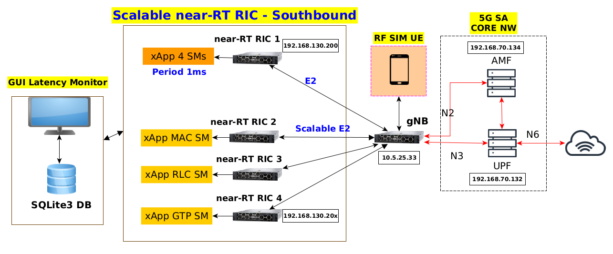

# Distributed near-Real Time RAN Intelligence Controller (near-RT RIC)

A comprehensive distributed near-Real Time Radio Access Network (RAN) Intelligence Controller implementation featuring seamless OpenAirInterface5G integration with multi-E2 interface support, an enhanced FlexRIC framework, and sophisticated AI-driven network optimisation capabilities. This repository encompasses a complete 5G Core network, providing all requisite software modules for comprehensive end-to-end system deployment and evaluation.

This research and development work has been conducted at the [6G Innovation Centre](https://www.surrey.ac.uk/institute-communication-systems/5g-6g-innovation-centre), University of Surrey, as part of ongoing investigations into next-generation wireless network intelligence and automation.

**📺 Demo Video**: Watch the [distributed near-RT RIC demonstration](https://youtu.be/zdzNcn-rkQc) showing the complete system deployment and real-time measurements visualised on the Grafana dashboard.

## Architecture



## Features

- **FlexRIC Framework**: Distributed near-RT-RIC implementation improving the OAI FlexRIC with the config files to run the banchemarks
- **AI/ML Optimization**: DQN-based load balancing and network optimization
- **OAI O-RAN Implementation**: Extended OAI RAN source code to support multiple E2AP interfaces with the config files to run the banchemarks
- **5G Core Network**: Complete OAI CN5G for the setup and have the same environment as our testbed

## Components

### Core Components
- **OpenAirInterface5G**: 5G RAN implementation with E2 agent
- **FlexRIC**: Near-real-time RIC platform
- **OAI CN5G**: 5G Core Network functions
- **[DQN RIC](https://github.com/zitouni/DqnRic)**: AI-driven Load balancer optimization ([README](https://github.com/zitouni/DqnRic/blob/main/README.md))

### Key Directories
- `openairinterface5g/`: 5G RAN with E2 interface
- `flexric/`: Distributed near-RT RIC implementation
- `oai-cn5g-fed/`: 5G Core Network federation
- `DqnRic/`: Deep Q-Network based optimization of indication messages routing 

## Quick Start

### Prerequisites
- Ubuntu 20.04/22.04 or RHEL 8/9
- CMake 3.15+
- GCC 9+

### Build of OpenAirInterface5G with E2

```bash
cd openairinterface5g/cmake_targets
./build_oai --gNB --nrUE -w SIMU -w USRP --build-lib nrscope --build-e2 --ninja
```

For detailed installation instructions, see the [Installation Guides](#installation-guides) section below.

### Build the extended FlexRIC 

The flexric is part of the OAI RAN project (openairinterface5g) at "/openairinterface5g/openair2/E2AP". 
```bash
git checkcout scale-ric
cd flexric
mkdir build
cmake .. 
make -j$(nproc)
sudo make install
```
For detailed installation instructions, see the [Installation Guides](#installation-guides) section below.
### Deploy 5G Core Network

```bash
cd oai-cn5g-fed/docker-compose
python3 core-network.py --type start-basic --scenario 1
```

For detailed installation instructions, see the [Installation Guides](#installation-guides) section below.

## Configuration

- **RIC Configuration**: `flexric/demo-dist`
- **OAI Configuration**: `openairinterface5g/ci-scripts/CONF_25-33`
- **Core Network**: `oai-cn5g-fed/docker-compose/`

## Run Demo 

For a comprehensive demonstration of the distributed RIC system, please refer to the [Demo Guide](https://github.com/zitouni/flexric/blob/master/DEMO_DIST.md) which provides detailed instructions for running the complete end-to-end setup.


## Installation Guides

### OpenAirInterface5G
- [Build Guide](https://github.com/zitouni/openairinterface5g/blob/main/doc/BUILD.md)
- [Run Guide](https://github.com/zitouni/openairinterface5g/blob/main/doc/RUNMODEM.md)
- [Features](https://github.com/zitouni/openairinterface5g/blob/main/doc/FEATURE_SET.md)
- [E2AP Integration](https://github.com/zitouni/openairinterface5g/blob/main/openair2/E2AP/README.md)

### FlexRIC
- [Main Installation Guide](https://github.com/zitouni/flexric/blob/master/README.md)

### OAI 5G Core Network
- [Main Guide](https://github.com/zitouni/oai-cn5g-fed/blob/master/README.md)
- [Home Deployment](https://github.com/zitouni/oai-cn5g-fed/blob/master/docs/DEPLOY_HOME.md)
- [Prerequisites](https://github.com/zitouni/oai-cn5g-fed/blob/master/docs/DEPLOY_PRE_REQUISITES.md)
- [Debug Guide](https://github.com/zitouni/oai-cn5g-fed/blob/master/docs/DEBUG_5G_CORE.md)

## Documentation

## License

This project combines multiple open-source components with their respective licenses. See individual component directories for specific license information.

## Acknowledgments

<p align="center">
  <a href="https://www.surrey.ac.uk/institute-communication-systems/5g-6g-innovation-centre">
    
  </a>
</p>

This research and development work was supported by the [University of Surrey](https://www.surrey.ac.uk/) and the [5G & 6G Innovation Centre](https://www.surrey.ac.uk/institute-communication-systems/5g-6g-innovation-centre) within the TUDOR and HiperRAN projects.

---

© 2025 Rafik ZITOUNI
